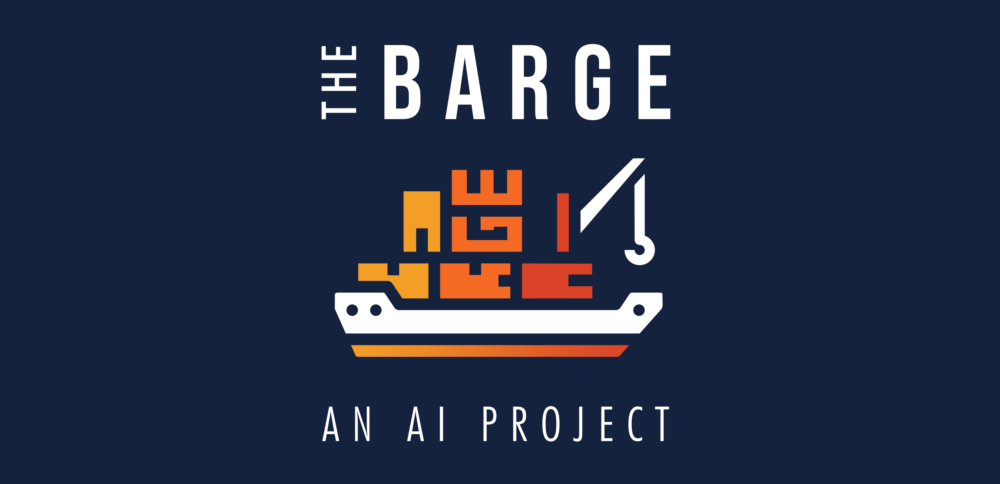

# :ship: THE BARGE
**THE BARGE** is a portfolio repository for all the AI related projects I have done for academic, self-learning and hobby purposes.

As an Automation Engineer and AI enthusiast, during my career I had the opportunity to practice different sub-fields of Artificial Intelligence. Therefore, **THE BARGE** is arranged in different *decks*: 
- [**Machine Learning Projects**](#machine-learning-projects)
- [**Computer Vision Projects**](#computer-vision-projects)
- [**Autonomous Systems Projects**](#autonomous-systems-projects)

If you have any question on the featured projects or if you are interested in activating a collaboration do not hesitate to write me at bargellesi.n@gmail.com or on .

### :whale: Welcome on board!

 

## Machine Learning Projects
 **[A Random Forest-based Approach for Hand Gesture recognition](https://github.com/iambarge/GR-project)** \

Gesture Recognition has a prominent importance in smart environment and home automation. In this project we propose a Random Forest-based approach for hand Gesture Recognition starting from wireless wearable motion capture data.

##

## Computer Vision Projects
 **[Coin Detection and Classification using CV-based Strategies](https://github.com/iambarge/CV-coins-project)** \

Coin identification and recognition can significantly enhance the functions of vending machines, pay phone systems and coin counting machines. The primary purpose of this project is to develop a detector capable of finding and classifying Euro coins in images purely relying on CV frameworks.

##

## Autonomous Systems Projects
 **[Interactive Surveillance Using a UAV Mounted Camera Network](https://github.com/iambarge/NC4MAS-security-drones-project)** \

The possibility to mount cameras on Unmanned Aerial Vehicles (UAVs) may extend the capabilities of Multi-Camera surveillance systems to a whole new level. This project aims to find a solution to the Interactive Surveillance problem using multiple UAV mounted cameras.

##
