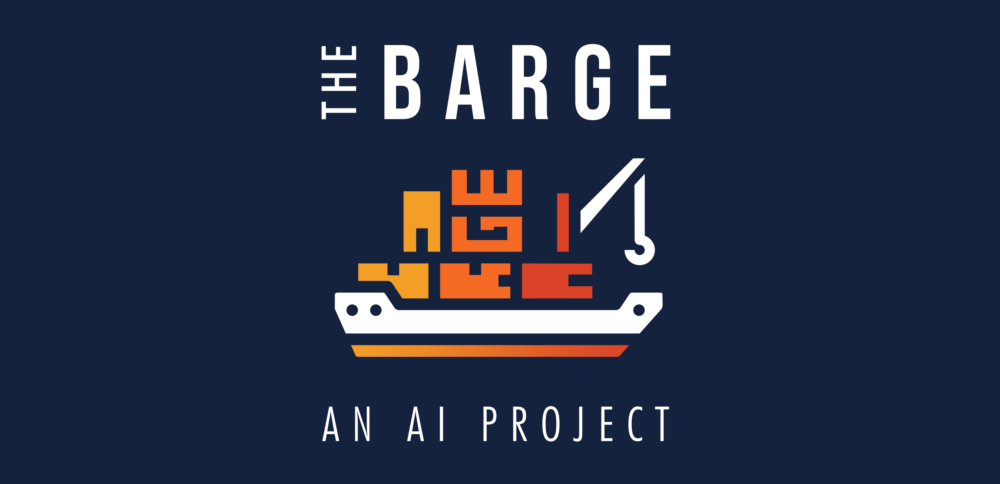
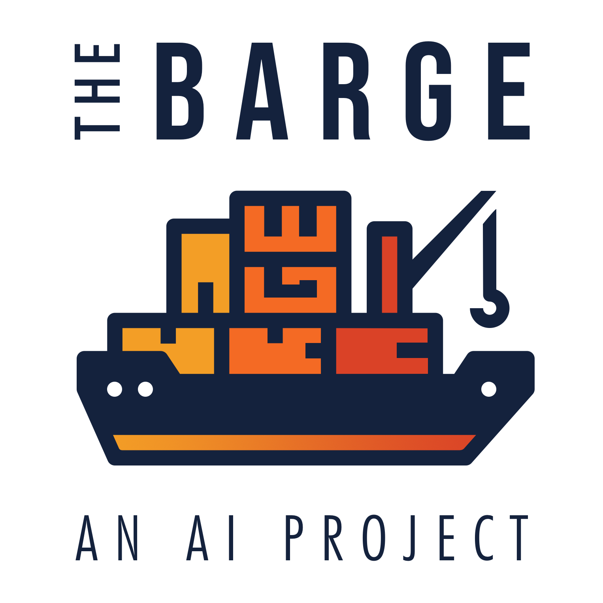

# THE BARGE
**THE BARGE** is a repository for all the AI related projects I have done for academic, professional, self-learning and hobby purposes.

As an Automation Engineer and AI enthusiast, during my career I had the opportunity to practice different sub-fields of Artificial Intelligence. Therefore, **THE BARGE** is arranged in different *decks*: 
- [**Machine Learning Projects**](#machine-learning-projects)
- [**Computer Vision Projects**](#computer-vision-projects)
- [**Autonomous Systems Projects**](#autonomous-systems-projects)

### Welcome on board!! :ship: :whale:

 

## Machine Learning Projects

 **[Project Title](https://github.com/iambarge/the-barge-ai)**

Brief Project Description.

Possibly 2-3 lined for correct spacing.
#

## Computer Vision Projects

## Autonomous Systems Projects
